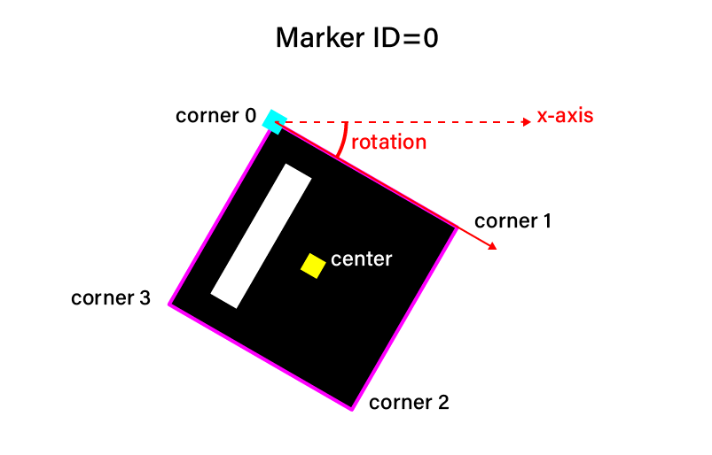
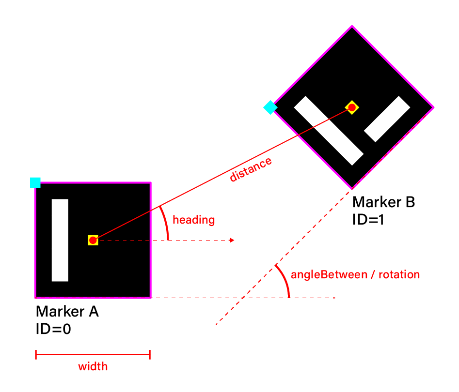

# Beholder Detection
This is the marker detection component of Beholder.

## Installation
```
npm install beholder-detection
```

## Usage
Basic Example
```
const Beholder = require('beholder-detection');
```

### General Functions
| syntax | usage |
| --- | --- |
| `init()` | Initializes Beholder and appeneds needed elements to the DOM (video and webgl canvas) |
| `update()` | Runs detection code and updates all marker objects |
| `show()` | Reveals detection overlay |
| `hide()` | Hides detection overlay |

### Individual Marker
| syntax | usage |
| --- | --- |
| `getMarker(ID)` | returns Marker object with corresponding ID.<br>`ID` should be an integer between `0` to `99`. |
| `getMarker(ID).present` | returns Marker presence as either `true` or `false`. |
| `getMarker(ID).timeout` | returns Marker timeout in milliseconds. If a marker is not detected again within the timeout window, its presence is set to `false`.<br>Set timeout value with the following statement:<br>e.g. `getMarker(ID).timeout = 100` |
| `getMarker(ID).center` | returns Marker center as an object in the form<br>`{ x: val, y: val }`. |
| `getMarker(ID).corners` | returns Marker corners as an array of 4 objects corresponding to the corners of the marker, starting with the top-left corner. Each corner in the form<br>`{ x: val, y: val }`.<br>Individual corners can be accessed via their index, e.g. `.corners[0]` |
| `getMarker(ID).rotation` | returns Marker rotation in radians as a float between `-pi` to `pi`. |



**Example Usage**

    var demoMarker = Beholder.getMarker(0);
    
    if( demoMarker.present ) {
        var demoCenter = demoMarker.center;
        var demoRotation = demoMarker.rotation;
        
        console.log(demoCenter.x, demoCenter.y, demoRotation);
    }

### Marker Pairs
| syntax | usage |
| --- | --- |
| `getMarkerPair(ID_A, ID_B)` | returns MarkerPair object with corresponding pair of IDs.<br>`ID_A` and `ID_B` should be an integer between `0` to `99`. |
| `getMarkerPair(ID_A, ID_B).distance` | returns distance in pixels between marker pair. |
| `getMarkerPair(ID_A, ID_B).angleBetween` | returns angle between marker pair in radians as a float between `-pi` to `pi`. |
| `getMarkerPair(ID_A, ID_B).getRelativePosition(size)` | returns estimate of real world position of marker B relative to marker A. `size` is the width of marker A.<br> This method returns an object with three properties: `distance`, `heading`, and `rotation` (see figure below). |



**Example Usage**
```
var demoMarkerPair = Beholder.getMarkerPair(0, 1);
var realWorldPosition = demoMarkerPair.getRelativePosition(25);

console.log(realWorldPosition.distance, realWorldPosition.heading, realWorldPosition.rotation);
```
